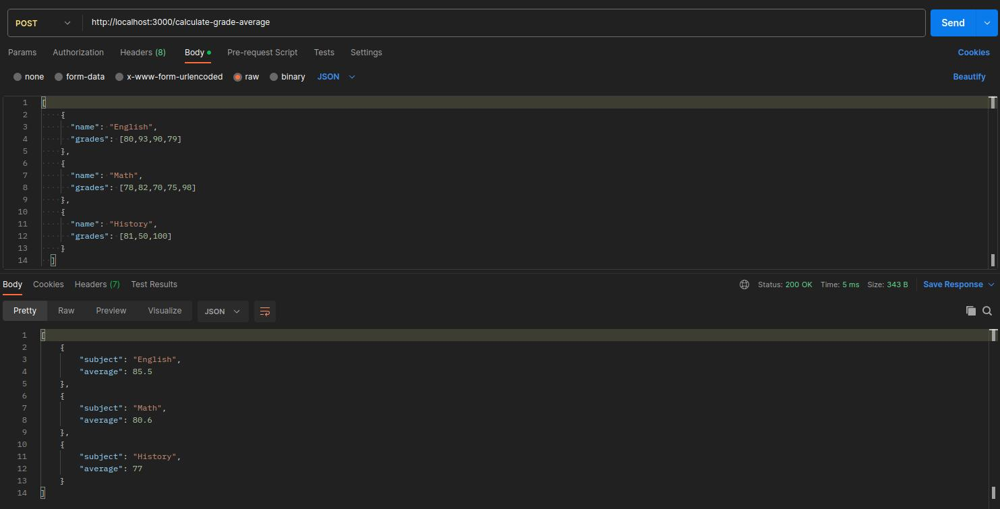

<strong><h1 align="center">Grade Average</h1></strong>
<p align="center"><strong>Project developed for a technical challenge/test</strong></p>

<p align="center">
  
</p>

## 🚀 Challenge
Create a program that takes a student's grades in three different subjects and calculates the average of the grades. Then display the calculated average.

## 🛰️ Technologies
This project was developed with the following technologies:

- Node.js
- Express
- Jest
## 💻 Installation / How to use
- Clone this repository:
   ```bash
   git clone https://github.com/jairokoning/grade-average-api.git
   ```
- Install dependencies:
   ```bash
   yarn install
   ```
- Start the application
   ```bash
   yarn dev
   ```
- Run tests
   ```bash
   yarn test
   ```
- Execute http://localhost:3000/calculate-grade-average on a API Client for REST (Insomnia, Postman...)
- Send the subject/grade information in the following format in the body of the post request for get the average
   ```json
   [
      {
         "name": "English",
         "grades": [80,93,90]
      },
      {
         "name": "Math",
         "grades": [78,82,70]
      },
      {
         "name": "History",
         "grades": [81,50,100]
      }
   ]
   ```
---

_Developed with_ 😀 _and_ ❤️ _by [Jairo Koning](https://linkedin/in/jairokoning)_